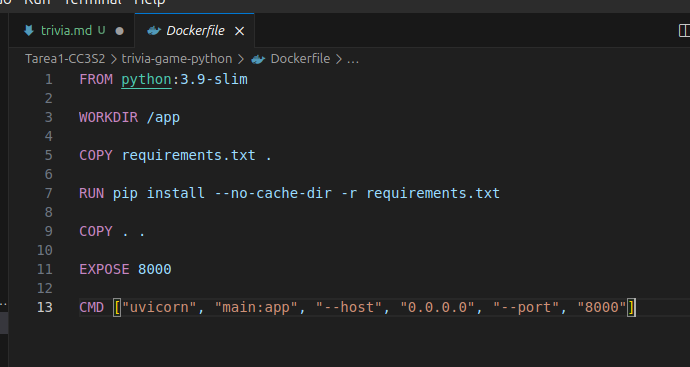

# Sprint 1 : Estructura básica
En este primer sprint se configura el entorno virtual y se gestionan algunas dependencias, seguido por crear nuestro archivo Dockerfile y docker-compose.yml, finalmente creamos algunas clases para nuestra trivia y hacemos sus test respectivos.

La estructura del proyecto será la siguiente:

## Configuración del entorno virtual y instalación de dependencias

Creamos un entorno virtual y lo activamos:

```
python3 -m venv venv
source venv/bin/activate
```

Ahora instalamos las dependencias en el entorno creado, estamos instalando la biblioteca de fastapi y asyncpg.
```
pip install fastapi uvicorn
pip install asyncpg databases
```

## Dockerfile y docker-compose.yml
Luego creamos un Dockerfile, esto nos permitirá luego crear la imagen de nuestro proyecto y definir su entorno.


También creamos nuestro docker-compose.yml, este archivo nos permitirá configurar en qué puertos se van a levantar los diferentes servicios que tengamos, en nuestro caso la app y la base de datos.


## Question.py and Quiz.py

Creamos dos archivos Question.py y Quiz.py, aquí tendremos las clases que nos servirán para la lógica de nuestra trivia.

La primera clase que creamos es Question, aquí vamos a definir un constructor el cuál va a aceptar parámetros como la descripción de la pregunta, las opciones de respuesta y la respuesta correcta, también tendremos como un método o función de esta clase una llamada is_correct que aceptará un parámetro answer y comparará con la respuesta correcta definida.


La segunda clase es Quiz, aquí cuando se instancie un objeto de esta clase se tendrá un array de preguntas vacío el cuál se llenará y también un index con valor inicial 0 el cuál va a controlar que no supere la cantidad de preguntas que haya en el array. 


## Test

En esta última parte del sprint, creamos un folder test, aquí importamos la librería que instalamos al principio, osea pytest, y también importamos nuestras clases que usaremos para cada test. Primero crearemos un test para la clase Question ya que la finalidad de este test es verificar si el método is_correct de esta clase se está comportando de acuerdo a lo que queremos, es decir si le ponemos una respuesta correcta que retorne true y si no, que retorne false.


Aquí tenemos el output del test, el cuál fue exitoso en ambos items, para la respuesta correcta esperada y para la respuesta incorrecta también esperada.


# Sprint 2: Lógica del juego y puntuación

Ampliamos la clase quiz para implementar un sistema de puntuación, agregando dos contadores, uno para las respuestas correctas y otro para las incorrectas; y aumentándole al contador de cada uno luego de verificar con el método de is_correct.


Luego manejámos las rondas, primero haremos una instancia de Quiz, luego mientras el índice sea menor a 10 para cada pregunta se imprimirá su descripción, las opciones y una respuesta de espera.


## Test
Creamos un pequeño test para la clase Quiz, aquí verificamos que se pueda instanciar bien la clase y que funcionen correctamente su método para agregar preguntas y verificar la respuesta correcta.


El test es exitoso:


# Sprint 3: Mejora de la interfaz


