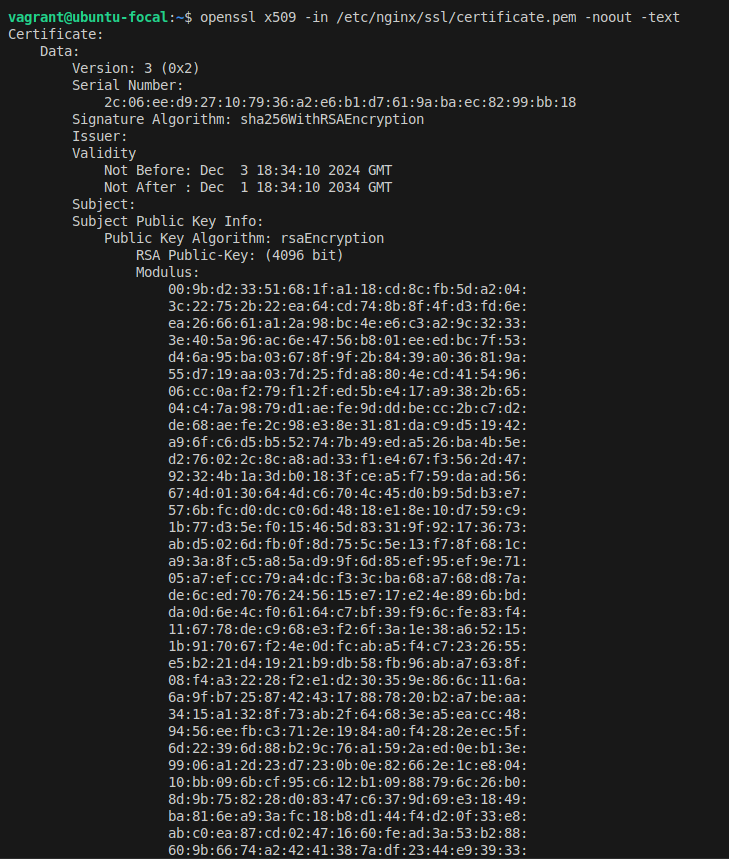

# Ejercicio 1

- Con el comando 'vagrant ssh' accedemos a la terminal de la vm desde la maquina host y verificamos que exista el usuario devuser:


- Y que el sistema esté actualizado:


- También verificamos el grupo admin:


- Y la zona horaria:


# Ejercicio 2
- Mostramos la fecha del certificado

- Mostramos el certificado y sus metadatos:

- Con el comando ```curl -k https://localhost``` mostramos lo que el servidor manda cuando nos conectamos a esa dirección y realizamos la solicitud.


Vemos que salía 403 forbidden y era porque Nginx no podia servir lo que salía del directorio /var/www/html cuando nos conectábamos a la dirección del localhost, ya que teníamos esto:

```
location / {
        root /var/www/html;
        index index.html index.htm;
    }
```

Sin tener un index.html, pero al agregar el archivo que sí teníamos, osea indez.nginx-debian.html, ahora sí salió y pudo servir bien.

```
index index.html index.htm index.nginx-debian.html;
```

Al usar de nuevo el comando ```curl -k https://localhost``` :
