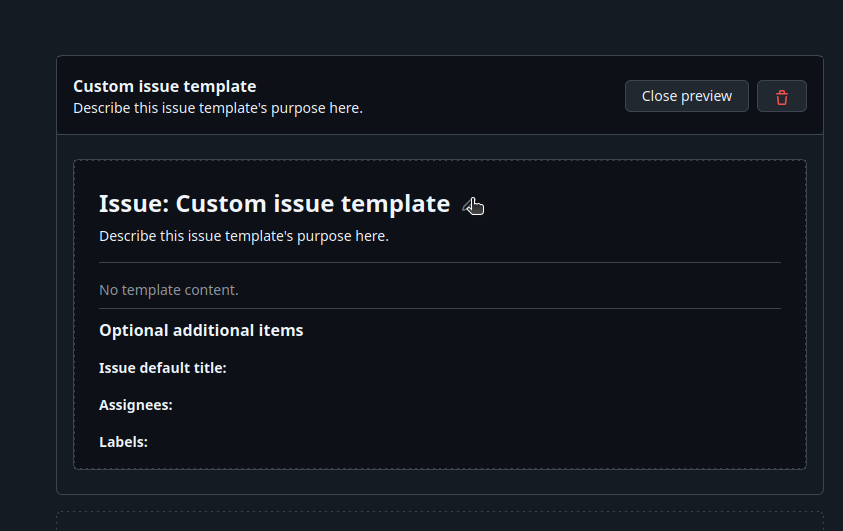

# Actividad 7 - Config de Kanban board, creación de historias de usuario!
----------

## Parte 1: Configuración de Kanban board
- Primero en nuestro repo vamos a 'Proyects' y creamos un nuevo proyecto.
 
- Seleccionamos Kanban y lo nombramos como Lab Agile Planning:

- Al crearlo nos saldrá este board con Backlog, Ready, In Progress, In review, y Done, los cuales son columnas predeterminadas que siguen un flujo de trabajo.

- Podemos cambiar sus nombres y colores de las columnas en 'edit details' si queremos, para una mejor adaptabilidad de nuestro flujo de trabajo.

Podemos crear más columnas y arrastrarlas hacia una posición específica dentro del flujo.

## Parte 2 : Creando issues templates para historias de usuario
- Nos dirigimos a `Settings`.

- Buscamos la sección `Features` y le damos click a `Set up templates`

- Hacemos click en `Preview and edit`

- Le damos al lápiz para configurar:

- Dentro de `Template content` escribimos nuestro template y añadimos un Template name y una descripción.

- Finalmente commiteamos los cambios realizados.

## Parte 3 : Creación de historias de usuarios.
- Primero entramos a Issues y ponemos en `New Issue`

- Hacemos click en `Get Started`

- Agregamos un título y una descripción

- Debería aparecer de esta manera:

- En la parte derecha en `Proyects` lo vinculamos con Lab Agile Planning y  en status ponemos `New Issues`

- Editamos el límite de issues que acepta y lo pasamos de 5 a 7

- De esta manera vamos poniendo los issues...

- Movemos las diferentes historias de usuario

## Parte 4: Refinamiento del backlog

- Need the ability to remove a counter, deploy service to the cloud y Need the ability to update a counter to a new value, son 3 issues que de acuerdo a las necesidades se han puesto Icebox y Product Backlog

- Editamos todas las historias que tenemos, que son 7, tendría que verse así:

### Creacion de labels
- Desde nuestro repo vamos a Issues y buscamos `labels`

- Creamos la label

- Seleccionamos en enhacement 
