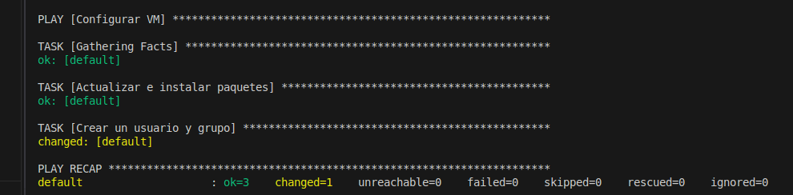
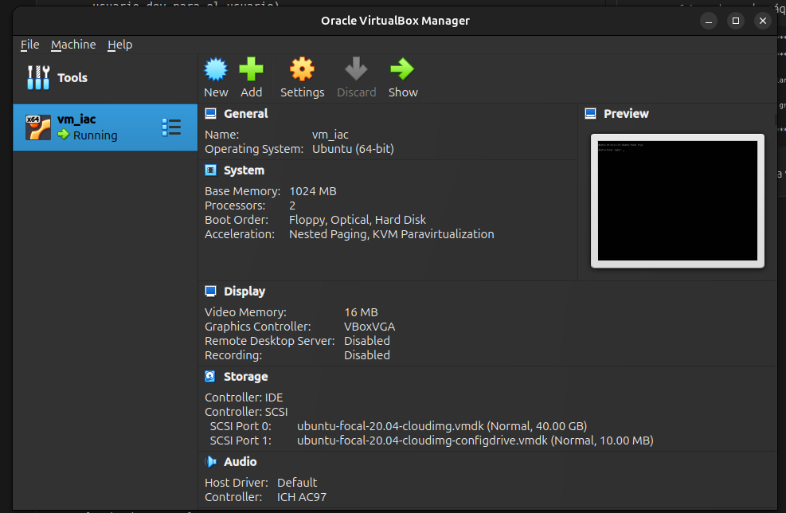
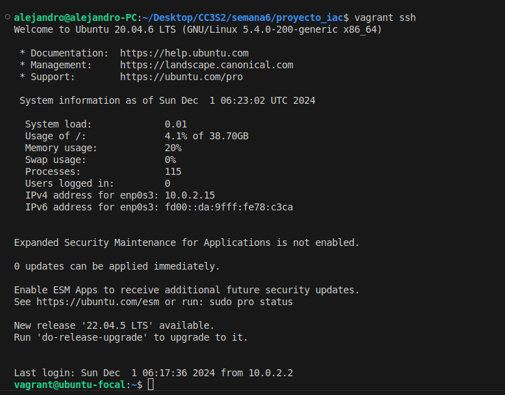
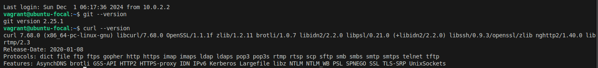
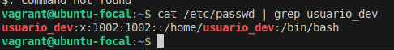
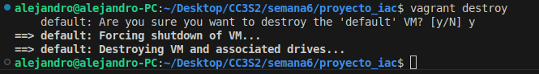

En esta actividad voy a crear y configurar una vm ubuntu utilizando Vagrant y Ansible.

1. Primero descargamos Vagrant, Ansible y el Oracle Virtual Box.

2. Creamos una carpeta, en este caso proyecto_iac

3. Con el comando ```vagrant init ubuntu/focal64``` crearemos un VagrantFile con una configuración básica para una VM de Ubuntu 20.04

4. Editamos el Vagrantfile para agregar configuración adicional:
- Configuramos una red privada para la vm, la cuál le asignaremos una dirección IP con DHCP.

```
config.vm.network "private_network", type: "dhcp"
```

- Configuramos como proveedor a VirtualBox, y le decimos cuánta memoria va a asignar a la vm y cuál será el nombre para la vm.

```
config.vm.provider "virtualbox" do |vb|
  vb.memory = "1024"
  vb.name = "vm_iac"
end
```
- Configuramos Vagrant para utilizar Ansible como aprovisionador.

```
config.vm.provision "ansible" do |ansible|
  ansible.playbook = "playbook.yml"
end
```

5. Creamos un archivo ```playbook.yml``` el cuál es un playbook de Ansible, quien describirá las tareas que se deben realizar para automatizar la gestión de configuración de un sistema, en este caso la VM.


```
---
- name: Configurar VM
  hosts: all
  become: yes
  become_method: sudo
  remote_user: vagrant
  tasks:
    - name: Actualizar e instalar paquetes
      apt:
        update_cache: yes
        name:
          - git
          - curl
        state: present

    - name: Crear un usuario y grupo
      user:
        name: "usuario_dev"
        groups: "sudo"
        append: yes
        shell: "/bin/bash"
        create_home: yes
```

Aquí estamos especificando que el nombre del playbook será 'Configurar VM', define que el become_method será sudo para elevar los privilegios, el usuario que se usará será Vagrant para conectarse a la VM ya que este usuario normalmente tiene acceso al SSH y privilegios de administrador.

Luego con tasks definimos las dos tareas, Actualizar e instalar paquetes (En este caso queremos actualizar e instalar git y curl), y Crear usuario y grupo (Aquí se crear el usuario con nombre usuario_dev y lo añade al grupo sudo para que tenga permisos de administrador, especificamos también que el interprete para el usuario será bash y creamos un directorio /home/usuario_dev para el usuario)

6. Levantamos la máquina virtual con el comando ```vagrant up```:



Vemos en el virtualbox la vm llamada vm_iac está corriendo:




7. No es necesario entrar a la virtualbox y abrir una terminal, ya que con el comando ```vagrant ssh``` podemos abrir una terminal de la vm en nuestra máquina host.



8. Verificamos si dentro de la vm se instalaron los paquetes de git y curl:

```
$ git --version
$ curl --version
```


9. Verificamos si el usuario existe
```
$ cat /etc/passwd | grep usuario_dev
```


10. Finalmente podemos salir de la terminal de la VM con el comando ```exit``` y destruir la vm creada con ```vagrant destroy```.

