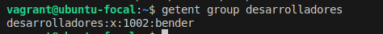
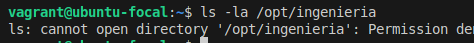
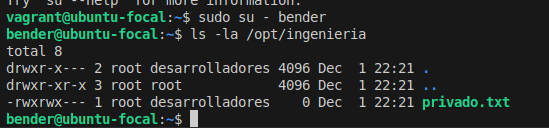
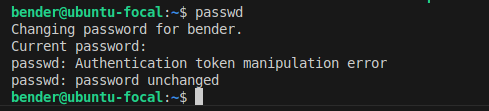
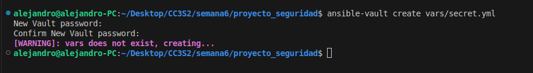
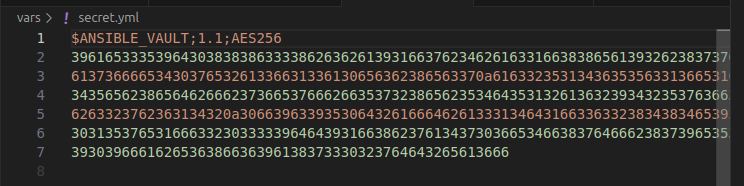

# Gestion de Usuarios y seguridad con Linux y Ansible

En esta actividad voy a listar los pasos que he seguido para poder automatizar la configuración de políticas de contraseñas, gestión de usuarios y grupos, así como de permisos de archivos y directorios.

1. Lo primero fue tener instalado el Vagrant, VirtualBox y Ansible.
2. Luego, creamos una carpeta llamada proyecto_seguridad.
3. Con el comando ```vagrant init ubuntu/focal64 ``` creamos un archivo VagrantFile, aquí vamos a configurar la red privada, el proveedor que será VirtualBox y el aprovisionador Ansible.
4. Creamos un playbook de Ansible llamado site.yml el cuál tendrá dos tasks que se importarán desde otro archivo.
5. Creamos una carpeta tasks que contendrá dos archivos yaml los cuáles contendrán las tareas que se usarán para el playbook de Ansible.
6. En el archivo pam_pwquality.yml tenemos: 

En esta parte tenemos el módulo apt, el cuál maneja los paquetes que queremos instalar o queremos que existan, en este caso el libpam-pwquality
```
---
- name: Instalar libpam-pwquality
  apt:
    name: libpam-pwquality
    state: present
```

En esta parte queremos configurar pam_psquality y el módulo lineinfile se usa para verificar que exista una línea específica, mientras que en line ya se especifíca lo que debe estar, es decir el password debe seguir esa especificación.
```
- name: Configurar pam_pwquality
  lineinfile:
    path: "/etc/pam.d/common-password"
    regexp: "pam_pwquality.so"
    line: "password requisite pam_pwquality.so retry=3 minlen=12 lcredit=-1 ucredit=-1 dcredit=-1 ocredit=-1 enforce_for_root"
    state: present
```

7. En el archivo user_and_group.yml tenemos las otras tareas, las cuales se vinculan a la creación de los usuarios(bender, con un password) y la creación de grupos(desarrolladores), y directorio(ingeniería), ya que utiliza los módulos (user, group y file). 

Sacado del código:

Creamos el grupo desarrolladores si no existe.
```
- name: Asegurar que el grupo 'desarrolladores' exista
  group:
    name: desarrolladores
    state: present
```

Creamos el usuario bender
```
- name: Crear el usuario 'bender'
  user:
    name: bender
    shell: /bin/bash
    password: "{{ 'TuContraseñaSegura' | password_hash('sha512') }}"
```
Asignamos bender a desarrolladores
```
- name: Asignar 'bender' al grupo 'desarrolladores'
  user:
    name: bender
    groups: desarrolladores
    append: yes
```
Creamos un directorio llamado ingeniería y con el modulo file indicamos su path. En mode vemos un numero de 4 dígitos, el primero representa permisos especiales, los otros tres representa al propietario, grupo y otros. 
El número 4 es Lectura, el 2 escritura y el 0 ninguno y el 1 ejecución. La suma como el 7 representa todos los permisos, y las demás sumas los permisos combinados. En este caso estamos dando permisos completos al propietario y permisos de lectura y ejecución al grupo.
```
- name: Crear un directorio llamado 'ingenieria'
  file:
    path: /opt/ingenieria
    state: directory
    mode: '0750'
    group: desarrolladores
```

8. Levantamos la vm con el comando ```vagrant up```.
9. Ingresamos a la terminal de la VM dentro de nuestra terminal como máquina host con ```vagrant ssh```.
10. Con el comando ```getent passwd bender``` verificamos si existe el user

11. Verificamos si existe el grupo desarrolladores con ```getent group desarrolladores```

12. Intentamos acceder al directorio con ```ls -la /opt/ingenieria```


Vemos que no tenemos el permiso.
Entonces cambiamos al usuario bender con ``` sudo su - bender```
y volvemos a escribir el comando, ahora podemos ver el directorio


13. Intentamos cambiar la contraseña y vemos que no podemos ya que el sistema no nos deja.



14. Con el comando ```ansible-vault create vars/secret.yml``` usaremos la herramienta de ansible para cifrar contenido, en este caso una contraseña. Para ello, te pedira un password y creará el cifrado dentro de secret.yml

Escribimos el password dentro(presionando i para poder escribir) y luego ```:wq``` (primero Esc para salir de la escritura normal) y enter para salir

Vemos que se creo el archivo y está cifrado



